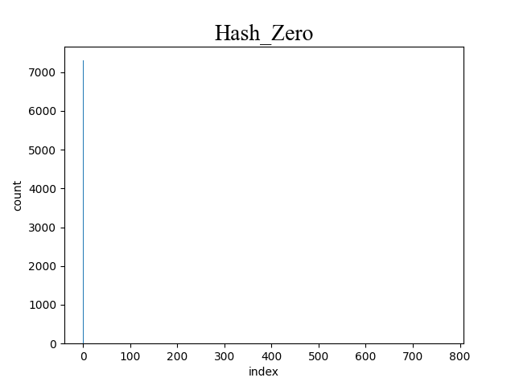
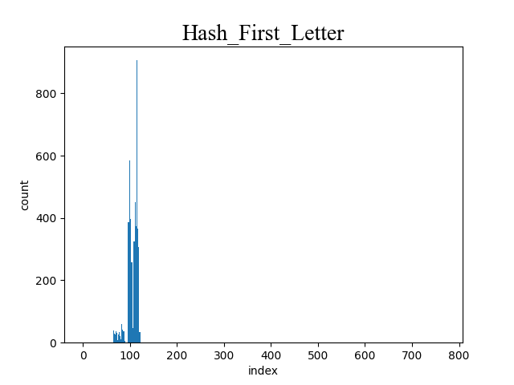
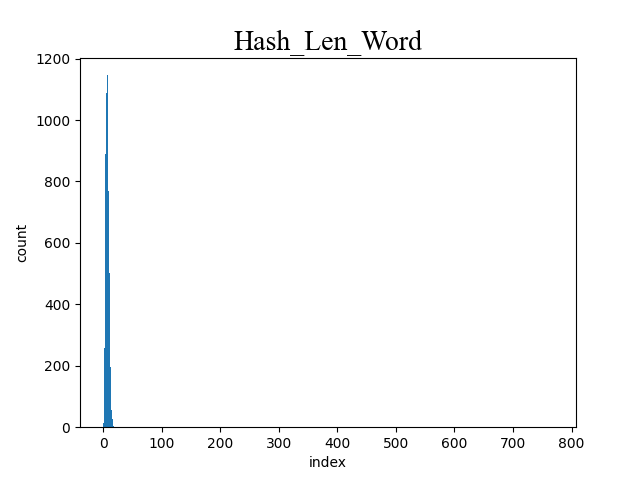
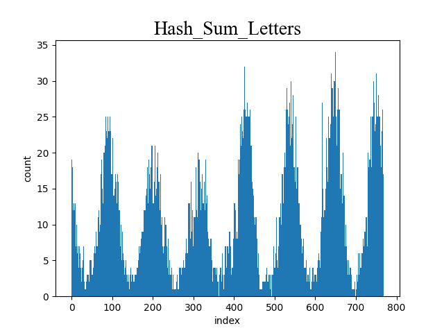
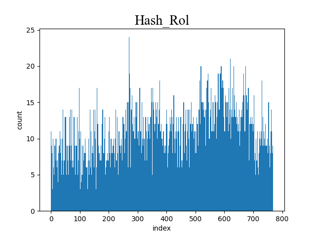
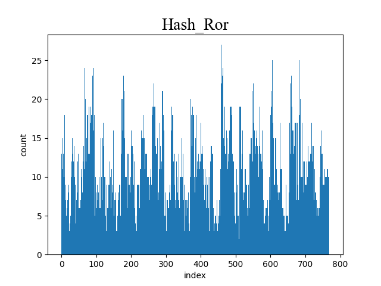

# Оптимизация хеш таблиц при помощи низкоуровневого кода.
## Задача
* Написать хеш-таблицу используя метод цепочек
* Написать 7 хеш-функций для нашей таблицы
* Написать 3 различных оптимизации
    * с помощью прямой ассемблерной вставки
    * с помощью SIMD инструкций
    * с помощью функции на ассемблере
## Ход работы
### 1) Реализовали хеш-таблицу на массиве указателей на списки.
### 2) Сравнение хеш функций:

Рассмотрим все функции хеширования и для каждой построим график, показывающий распределение элементов по хеш-таблице.

|hash всегда 0|hash = ASCII коду первого символа строки|
|:--:|:--:|
| | |
| Hash = длинна слова | Hash = сумма ASCII кодов каждого символа в строке |
| | |
|Hash = сдвиг по кругу вправо от предыдущего хеша | Hash = сдвиг по кругу влево от предыдущего хеша|
| | |
|Crc32_hash|
||

### Измерение дисперсии
|№ хеш-функции|хеш-функция|дисперсия|
|:--:|:--:|:--:|
|0   |0|263.0014|
|1   |ASCII str[0]|59.91|
|2   |len(str)|87.81|
|3   |sum ASCII str[i]|7.68|
|4   |ror(hash(n - 1)) * ASCII str[n]|3.8|
|5   |rol(hash(n - 1)) * ASCII str[n]|4.98|
|6   |crc32|3.22|

### В итоге видим, что лучшей оказалась хеш-функция CRC32, значит далее будем использовать ее.
## 3) Оптимизация
* оставим только флаг -O3
* При помощи утилиты valgring получаем временной профиль программы и наглядно посмотрим, что нам выгоднее будет оптимизировать. Напишем улучшенную версию.


Из временного профиля программы видно что больше всего времени тратится на strcmp, crc32, strlen следовательно их и будем оптимизировать.

Вот как выглядят наши оптимизации:
* ### strcmp -> my_strcmp
    Используя SIMD инструкции получим
    <details>
    <summary>my_strcmp</summary>

    ```C
    int my_strcmp(__m256i* str_1, __m256i* str_2)
    {
        __m256i str_reg_1 = _mm256_lddqu_si256(str_1);
        __m256i str_reg_2 = _mm256_lddqu_si256(str_2);

        __m256i res_cmp = _mm256_cmpeq_epi8(str_reg_1, str_reg_2);
        int mask = ~_mm256_movemask_epi8(res_cmp);
        return mask;
    }
    ```
    </details>

Выберем функцию для следующей оптимизации, исходя из результатов профилирования предыдущей версии программы


* ### crc32 -> my_crc32
    С помощью знаний ассемблера получим:
    <details>
    <summary>my_crc32</summary>

    ```assembly
    my_crc32:
        xor rax, rax
        mov eax, -1
        mov r11, 0
    Next_iter:
        crc32 eax, byte [rdi + r11]
        inc r11
        cmp r11, rsi
        jb Next_iter
        ret
    ```
    </details>

Выберем функцию для следующей оптимизации, исходя из результатов профилирования предыдущей версии программы


* ### strlen -> strlen_simd
    Переписав функцию с использованием прямой ассемблерной вставки, заметим ,что my_strlen даже медленнее стандартной strlen, так как стандартная функция strlen написана через SIMD инструкции. Попробуем обогнать!!!
    <details>
    <summary>my_strcmp</summary>

    ```C
    size_t my_strlen(char* str)
    {
        size_t len = 0;

        asm volatile(
            ".intel_syntax noprefix\n\t"

            "mov rdi, %1\n\t"
            "xor rcx, rcx\n"
            ".next%=: \n\t"
            "cmp byte ptr [rdi], 0\n\t"
            "je .end%=\n\t"
            "cmp byte ptr [rdi], 13\n\t"
            "je .end%=\n\t"

            "inc rcx\n\t"
            "inc rdi\n\t"
            "jmp .next%=\n"
            ".end%=: \n\t"
            "mov %0, rcx\n\t"

            ".att_syntax prefix\n"

            : "=r" (len)
            : "r" (str)
            : "%rcx", "%rdi", "cc"
        );

        return len;
    }
    ```
    </details>

    Написав strlen через SIMD инструкции, нам все же удалось обогнать стандартный strlen.

    <details>
    <summary>strcmp_simd</summary>

    ```C
    size_t strlen_simd(char* str)
    {
        __m256i zero    = _mm256_setzero_si256();
        __m256i xmm_str = _mm256_lddqu_si256((__m256i*) str);
        int mask = _mm256_movemask_epi8( _mm256_cmpeq_epi8(xmm_str, zero));

        if (mask != 0)
        {
            const char* zero_byte = (const char*) str + __builtin_ffs(mask) - 1;
            return zero_byte - str;
        }
    }
    ```
    </details>

Проведя замеры времени поиска 10000000 слов в нашей таблице, получим данные приведенные в таблице ниже.

|Оптимизация| время (сек) |Коэффициент ускорения относительно худшего времени| Коэффициент относительно предыдущей версии|
|:--:|:--:|:--:|:--:|
|-O0|11.5|1|1|
|-O3|6.87|1.67|1.67|
|-O3 и my_strcmp|4.51|2.55|1.52|
|-O3 и my_strcmp и my_crc32|3.77|3.05|1.2|
|-O3 и my_strcmp и my_crc32 и my_strlen|3.63|3.17|1.038|

Видно, что после последней оптимизации время работы уменьшилось на ~0.016, значит дальнейшая оптимизация будет нецелесообразна.

Запустим valgrind еще раз чтобы наглядно убедиться в том что дальнейшие оптимизации будут напрасны.


## Вывод
* оптимальной функцией для вычисления хеша оказалась функция crc32
* с помощью низкоуровневого кода и флагов оптимизации нам удалось ускорить нашу программу в ~2.56 раза
* КПД = $\frac{коэф \ ускорения}{кол-во \ ассемблерных \ инструкций} * 1000$ = $\frac{2.56}{3} * 1000 \approx 853.33$

#### ***"От всей души хочу выразить благодарность и признательность Дединскому Илье Рудольфовичу (мяу), Жебрякову Даниилу Александровичу, Водолаженко Ивану Геннадьевичу, за оперативную помощь в редакции работы, кропотливое прочтение моей статьи, ценные замечания и рекомендации"***
